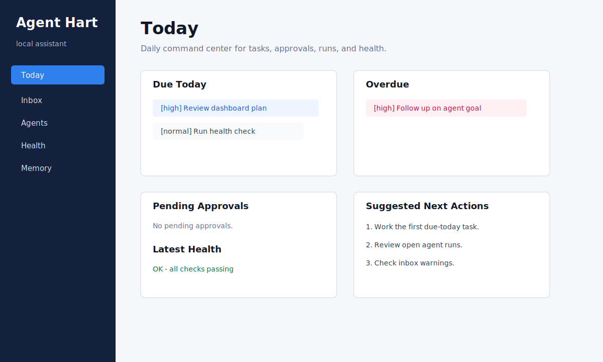
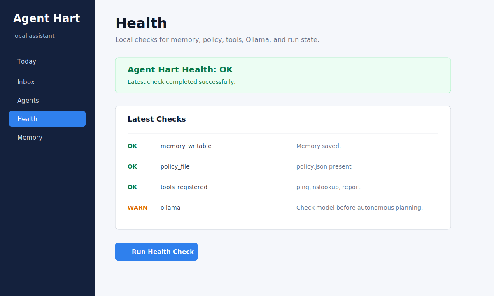

# Agent Hart

Agent Hart is a local-first personal AI assistant experiment. I am a student learning how to use AI, automation, Ollama, and agent-style workflows in a practical way. This project is intentionally built in small, understandable phases instead of trying to be a giant autonomous system all at once.

I am always open to suggestions, feedback, and improvement ideas. If you see a safer pattern, a cleaner architecture, or a useful feature that would make this better for day-to-day use, I would love to learn from it.

## What It Does

Agent Hart can help with:

- local chat through Ollama
- tasks, notes, lessons, and memory summaries
- approval-gated tool use
- Telegram commands
- agent profiles and goals
- supervised planner checkpoints
- health checks
- run reviews and simple outcome learning
- a minimal local web dashboard

It is not meant to be an unsupervised “do anything” bot. The design goal is a safe assistant that can grow toward automation while keeping memory, approvals, and tool use visible.

## Dashboard Preview





## Safety Notes

Do not commit real secrets or local memory.

This repo intentionally ignores:

- `.env`
- `agent_hart.db`
- `memory.json`
- `backups/`
- `reports/`
- `.claude/`
- caches and bytecode

Use `.env.example` as a template, then create your own private `.env`.

## Requirements

- Python 3.11+
- Ollama installed locally or reachable on your network
- Optional: Telegram bot token if you want Telegram control

Install Ollama from:

```text
https://ollama.com
```

Pull the default model:

```powershell
ollama pull gemma4
```

If you use a different model, update `OLLAMA_MODEL` in `.env`.

## Step 1: Clone The Repo

```powershell
git clone https://github.com/BHartDontStop88/AgentHart.git
cd AgentHart
```

## Step 2: Create A Virtual Environment

```powershell
python -m venv .venv
.\.venv\Scripts\Activate.ps1
```

If PowerShell blocks activation, run:

```powershell
Set-ExecutionPolicy -Scope CurrentUser RemoteSigned
```

Then activate again.

## Step 3: Install Dependencies

```powershell
pip install -r requirements.txt
```

## Step 4: Create Your Environment File

Copy the example:

```powershell
copy .env.example .env
```

Edit `.env`:

```powershell
notepad .env
```

Basic local Ollama setup:

```text
OLLAMA_MODEL=gemma4
OLLAMA_BASE_URL=http://localhost:11434
OLLAMA_TIMEOUT_SECONDS=60
OLLAMA_NUM_CTX=4096
OLLAMA_TEMPERATURE=0.2
AGENT_HART_MEMORY_BACKEND=sqlite
TELEGRAM_BOT_TOKEN=replace-with-your-bot-token
TELEGRAM_ALLOWED_USER_IDS=replace-with-your-numeric-telegram-user-id
```

Leave the Telegram values as placeholders unless you are setting up Telegram.

## Step 5: Run Tests

```powershell
python -m unittest discover -s tests
```

You should see all tests pass.

## Step 6: Check Ollama Health

Make sure Ollama is running, then run:

```powershell
python main.py
```

Inside Agent Hart:

```text
ollama health
```

You can also use:

```text
health check
health report
health history
```

## Step 7: Use The CLI Assistant

Start the CLI:

```powershell
python main.py
```

Useful commands:

```text
help
today
inbox
chat hello
add task Review dashboard --due today --priority high
list tasks
complete task 1
add note Remember to keep tool use approval-gated.
add lesson Prefer safe defaults.
memory stats
review memory
```

The `today` command is the daily command center. It shows due tasks, overdue tasks, approvals, open runs, health, and suggested next actions.

The `inbox` command shows items that need attention, such as pending approvals, suggested actions, open runs, and health warnings.

## Step 8: Use The Dashboard

Start the local dashboard:

```powershell
uvicorn dashboard:app --reload --host 127.0.0.1 --port 8000
```

Open:

```text
http://127.0.0.1:8000
```

Dashboard tabs:

- Today
- Inbox
- Agents
- Health
- Memory

The dashboard is intentionally minimal. It is meant for daily use, not marketing.

## Step 9: Create Agents And Goals

Agent profiles describe what an automation worker is allowed to do.

```text
add agent Reporter --role summarizer --tools report --max-steps 5
list agents
add goal 1 Write a daily status report
list goals
```

Check tool permission without executing anything:

```text
agent check-tool 1 report Daily
agent check-tool 1 ping localhost
```

Create one supervised planner checkpoint:

```text
plan-agent 1 1
```

This saves a task run and model response, but does not execute tools.

## Step 10: Use Approval-Gated Tools

Available tools are controlled by `policy.json`.

```text
tools
run report Daily
run ping localhost
approvals
approve <approval-id>
reject <approval-id>
```

Network tools require approval by default.

## Optional: Telegram Bot

Create a Telegram bot with BotFather, then put the token and your numeric Telegram user ID in `.env`.

Run:

```powershell
python telegram_bot.py
```

Useful Telegram commands:

```text
/help
/brief
/tasks
/done 1
/memory
/lessons
/addlesson <text>
/approvals
/run <tool> <target>
/approve <approval-id>
/reject <approval-id>
/chat <message>
```

Do not use `TELEGRAM_ALLOW_ALL=true` except for quick local experiments.

## Project Structure

```text
main.py                CLI assistant
dashboard.py           Local web dashboard
telegram_bot.py        Telegram interface
memory.py              JSON memory backend
structured_memory.py   SQLite memory backend
memory_factory.py      Backend selection
tools.py               Tool registry and policy enforcement
policy.json            Tool and network safety policy
ai.py                  Ollama integration
tests/                 Test suite
templates/             Dashboard HTML
static/                Dashboard CSS
skills/                Simple starter tool metadata
```

## Current Philosophy

Agent Hart is built around a few rules:

- keep memory durable
- keep tool use visible
- require approval for risky actions
- separate chat from automation
- checkpoint plans before execution
- track health and learning outcomes

The project is still a learning project, but it is being shaped toward a reliable day-to-day assistant.

## Feedback Welcome

I am learning, experimenting, and improving this as I go. Suggestions are welcome, especially around:

- safer automation patterns
- better Ollama prompts
- stronger memory design
- better dashboard usability
- test coverage
- agent health monitoring
- local-first workflows

## Help Me Improve

I built Agent Hart as part of my learning journey into AI, automation, cybersecurity, and practical software engineering. I am actively trying to grow into real-world work in this space, and I would genuinely appreciate feedback from people with more experience.

If you review this project, I would be grateful for suggestions such as:

- what I should refactor first
- what security risks I may be missing
- how to make the assistant more reliable
- how to improve the dashboard or user experience
- how to structure the project more professionally
- what tests or documentation would make this stronger
- what skills I should learn next to become job-ready

Constructive issues, pull requests, and advice are welcome. My goal is to keep improving this project and myself with it.
